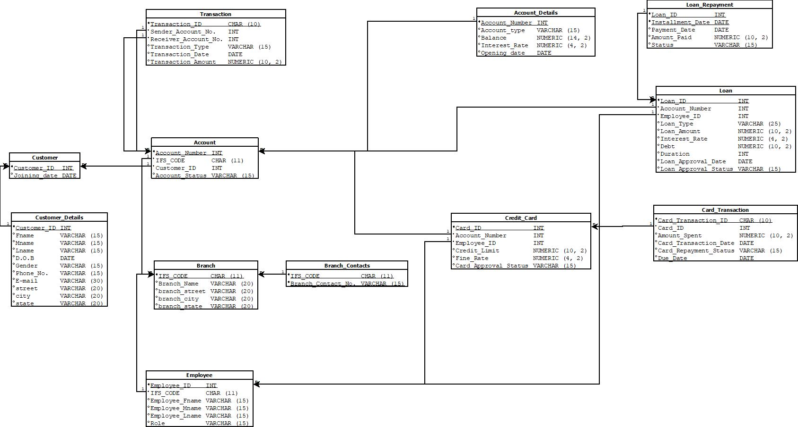

# 🏦 FundsAndFinanceBank: Bank Management System – DBMS Project

Welcome to **FundsAndFinanceBank**, a fully relational Bank Management System implemented using SQL. This project models a complete banking environment, enabling the management of customers, accounts, transactions, loans, branches, credit cards, and more using an RDBMS approach.

This system is designed to simulate the core functionalities of a real-world bank and emphasizes efficient schema design, normalization, and practical SQL querying.

---

## 📁 Project Structure
```
├── DDL_Script.sql            -- Complete schema creation (tables + constraints)
├── Data_Insertion.sql        -- Sample data insertion into the schema
├── Queries.sql               -- Many powerful and real-life banking SQL queries
├── ER_Diagram.jpeg           -- High-level ER diagram of the system
├── Relational_Diagram.jpeg   -- Relational schema with data types and keys
├── Minimal_FD_Set.pdf        -- Functional dependency analysis
├── Normalization_BCNF.pdf    -- Normalization report up to BCNF
└── README.md                 -- This file
```
---

## 🧠 Features & Modules

### 👤 Customers
- Stores basic info like name, DOB, gender, address, phone, and email.
- Tracks joining date and unique `Customer_ID`.

### 🏦 Branches
- Each branch is uniquely identified by `IFS_CODE`.
- Stores branch contact info and address.

### 💼 Accounts
- Each customer can have one or more accounts.
- Accounts can be `Savings`, `Current`, or `Fixed_Deposit`.
- Includes account balance, status, interest rate, and opening date.

### 🔄 Transactions
- Supports both account-to-account and credit card transactions.
- Tracks transaction ID, type, amount, and date.

### 💳 Credit Cards
- Each account may be issued a credit card, reviewed by an employee.
- Tracks approval status, fine rate, credit limit, etc.

### 💰 Loans
- Covers types like Home Loan, Education Loan, etc.
- Includes repayment tracking, approval status, interest rates, etc.

### 👨‍💼 Employees
- Employees work in specific branches and have roles like Manager, CSR, Loan Officer, etc.
- They are responsible for approving loans or credit cards.

---

## 🗂 ER Diagram


This ER diagram models the full relationship between the major entities: Customer, Account, Branch, Employee, Loan, Credit Card, and Transactions.

---

## 🧩 Relational Schema Diagram



This relational schema outlines:
- All primary and foreign keys
- Data types for each attribute
- Relationships via referential integrity

---

## 🔎 Sample SQL Queries

Here are a few interesting queries among all the **Advanced SQL queries** in `Queries.sql`:

1. **Top 5 Branches by Account Count**  
2. **Most Active Branches by Transaction Volume**  
3. **All Loan-Eligible Accounts**  
4. **Monthly Average Transaction Amount**  
5. **Customer Details with Unpaid Loans or Credit Cards**  
6. **Upcoming Loan Installments / Credit Card Due Dates**  
7. **Account Balance Growth for Fixed Deposits Over Time**  
8. **Branch with Highest Interest Rate for a Given City and Account Type**  
9. **All Associated Accounts of a Customer**  
10. **CSR and Manager Info per Branch**  

Every query is well-written, real-world applicable, and uses optimized SQL constructs (joins, aggregates, views, `EXTRACT`, `COALESCE`, `FULL OUTER JOIN`, `ROW_NUMBER`, etc.).

---

## 📊 Normalization & Functional Dependencies

- Normalized up to **BCNF**
- `Minimal_FD_Set.pdf` describes functional dependency analysis
- `Normalization_BCNF.pdf` describes how tables were normalized to remove redundancy and anomalies.

---

## 🛠️ Tools Used

- **PostgreSQL**
- **Draw.io / Dia**
- **pgAdmin**

---